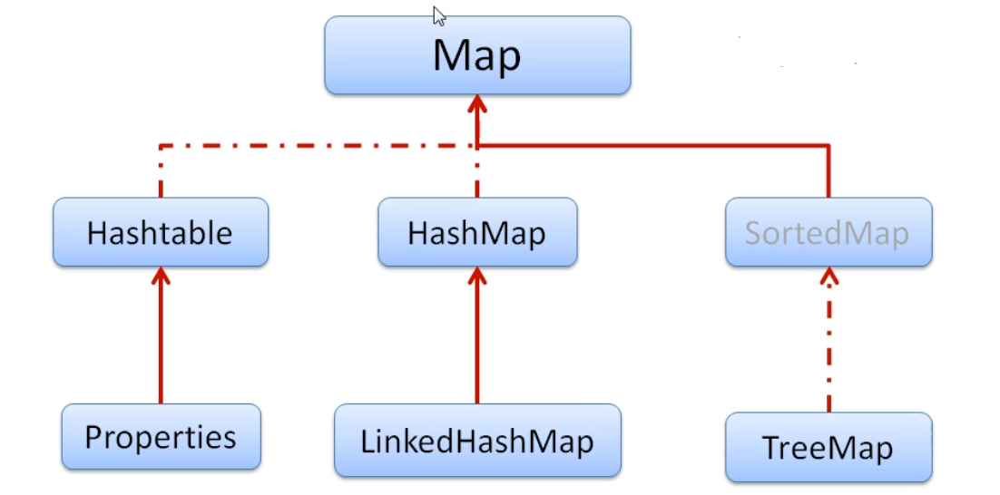
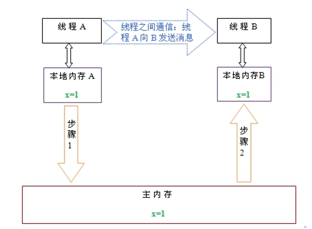

[TOC]

# Java

## java基础


## java集合

**集合概述**

- java集合可分为Collection和Map两种体系

  - Collection接口：

    - Set：元素无序、不可重复的集合
    - List元素有序、可重复的集合

    

  - Map接口：具有映射关系的“key-value”对的集合

    

### Collection

- 在迭代过程中不适合做增删。原因是集合里有个modCount的变量记录集合被增加或删除的次数，每次调用add、remove方法都会modCount++,获得一个迭代器时，迭代器里有个变量int expectedModCount = modCount，来记录获得迭代器时的modCount，在调用next方法时，都会检查modCount 是否与 expectedModCount相等，如果不相等则会抛出ConcurrentModificationException。

  ```java
  public E next() {
              checkForComodification();
            ......
          }
  void checkForComodification() {
              if (modCount != expectedModCount)
                  throw new ConcurrentModificationException();
          }
  ```

- 要在迭代过程中做删除，必须使用迭代器的remove方法。以ArrayList举例，它的迭代器底层还是调用的集合的remove方法，只不过它会通知更新此迭代器的expectedModCount。只是此迭代器的expectedModCount更新了。

  ```java
  
   public void remove() {
             ......
              checkForComodification();
  			......
                  expectedModCount = modCount;
              ......
          }
  ```

#### List接口

**特点**

- 有序
- 允许重复
- 允许插入null

##### ArrayList(JDK8)

底层为可变大小的数组Object[] elementData，初始容量为0，第一次添加时，扩容为10，再次添加时，如果容量足够，则不扩容，直接将新元素赋值到第一个空位上，如果容量不够，则扩容1.5倍。线程不安全。

增删效率低，需要循环移动后面的元素。因为数组空间连续，查找效率高。

```java
添加逻辑：
//无参构造
 public ArrayList() {
        this.elementData = DEFAULTCAPACITY_EMPTY_ELEMENTDATA;//private static final Object[] DEFAULTCAPACITY_EMPTY_ELEMENTDATA = {}，长度为0的Object数组
    }

//添加
public boolean add(E e) {
        ensureCapacityInternal(size + 1);  // Increments modCount!!
        elementData[size++] = e;
        return true;
    }

private void ensureCapacityInternal(int minCapacity) {
        if (elementData == DEFAULTCAPACITY_EMPTY_ELEMENTDATA) {//第一次添加才执行这步，初始化大小为DEFAULT_CAPACITY也就是10
            minCapacity = Math.max(DEFAULT_CAPACITY, minCapacity);
        }

        ensureExplicitCapacity(minCapacity);
    }

    private void ensureExplicitCapacity(int minCapacity) {
        modCount++;

        // overflow-conscious code
        if (minCapacity - elementData.length > 0)
            grow(minCapacity);
    }


 private void grow(int minCapacity) {
        // overflow-conscious code
        int oldCapacity = elementData.length;
        int newCapacity = oldCapacity + (oldCapacity >> 1);//位运算右移一位相当于除以2。扩容1.5倍的体现！！！
        if (newCapacity - minCapacity < 0)//只有第一次才执行，第一次的newCapacity为0
            newCapacity = minCapacity;
        if (newCapacity - MAX_ARRAY_SIZE > 0)//不能超过整型最大值
            newCapacity = hugeCapacity(minCapacity);
        // minCapacity is usually close to size, so this is a win:
        elementData = Arrays.copyOf(elementData, newCapacity);
    }

```

##### Vector

底层是可变数组，和ArrayList很像。线程同步。效率比ArrayList低。2倍扩容。

##### LinkedList


底层是双向链表，LinkedList维护了两个节点 Node<E> first和Node<E> last。每个节点里又维护了E item;Node<E> next;Node<E> prev;线程不安全。

增删效率较高，只需改变引用指向。查找效率较低，需要遍历查找。

#### Set接口

- 不允许重复，至多一个null
- 无序（取出顺序和存入顺序可以不一样）

##### HashSet

底层维护了一个HashMap对象。

去重实现：添加元素时先判断hashCode是否有重复，无重复直接添加，有重复则判断hash冲突的两个元素equals是否为true，为true则重复，add方法返回false。

##### TreeSet&TreeMap

底层维护了一个TreeMap对象public TreeSet() {    this(new TreeMap<E,Object>());}。TreeMap底层为红黑树。

添加的元素必须实现Comparable接口。如果调用无参构造则要实现元素compareTo方法来达到**排序**、**去重**目的。调用有参构造传入Comparator接口的实现实例，则实现Comparator的compare方法，来达到定制**排序**、**去重**的目的。

添加元素实现了Comparable接口又调用有参构造传入Comparator接口的实现实例，则按照Comparator的compare方法来排序。

```java
 TreeMap的put和get方法
     
  public V put(K key, V value) {
        Entry<K,V> t = root;
        if (t == null) {
            compare(key, key); // 第538行，检查元素是否实现了Comparable接口
         ......
        }
        Comparator<? super K> cpr = comparator;
        if (cpr != null) {//如果comparator不为空则按照comparator的规则排序
           .......
        }
        else {//否则按照元素的CompareTo方法排序
           ......
        }
     ......
    }

final Entry<K,V> getEntry(Object key) {
        if (comparator != null)
            return getEntryUsingComparator(key);//按比较器取出元素
       ......//按元素compareTo方法取出元素
        
    }
```

### Map

#### HashMap

HashMap 底层是数组 + 链表 + 红黑树的数据结构，数组的主要作用是方便快速查找，时 间复杂度是 O(1)，默认大小是 16，数组的下标索引是通过 key 的 hashcode 计算出来的，数 组元素叫做 Node，当多个 key 的 hashcode 一致，但 key 值不同时，单个 Node 就会转化 成链表，链表的查询复杂度是 O(n)，当链表的长度大于等于 8 并且数组的大小超过 64（MIN_TREEIFY_CAPACITY） 时，链表就会转化成红黑树，红黑树的查询复杂度是 O(log(n))，简单来说，最坏的查询次数相当于红黑树的最大深度。元素达到总容量的百分之75（threshold）时则2倍扩容。

##### 常见属性

```java
//初始容量为 16
static final int DEFAULT_INITIAL_CAPACITY = 1 << 4;
//最大容量
static final int MAXIMUM_CAPACITY = 1 << 30;
//负载因子默认值
static final float DEFAULT_LOAD_FACTOR = 0.75f;
//桶上的链表长度大于等于8时，链表转化成红黑树
static final int TREEIFY_THRESHOLD = 8;
//桶上的红黑树大小小于等于6时，红黑树转化成链表
static final int UNTREEIFY_THRESHOLD = 6;
//最小树形化容量阈值：即 当哈希表中的容量 > 该值时，才允许树形化链表 （即 将链表 转换成红黑树）
// 否则，若桶内元素太多时，则直接扩容，而不是树形化
// 为了避免进行扩容、树形化选择的冲突，这个值不能小于 4 * TREEIFY_THRESHOLD
static final int MIN_TREEIFY_CAPACITY = 64;
//记录迭代过程中 HashMap 结构是否发生变化，如果有变化，迭代时会 fail-fast
transient int modCount;
//HashMap 的实际大小，可能不准(因为当你拿到这个值的时候，可能又发生了变化)
transient int size;
//存放数据的数组
transient Node<K,V>[] table;
// 扩容的门槛，有两种情况
// 如果初始化时，给定数组大小的话，通过 tableSizeFor 方法计算，数组大小永远接近于 2 的幂次方
// 如果是通过 resize 方法进行扩容，大小 = 数组容量 * 0.75
int threshold;
//链表的节点
static class Node<K,V> implements Map.Entry<K,V> {
//红黑树的节点
static final class TreeNode<K,V> extends LinkedHashMap.Entry<K,V> {

```

##### Hash算法及位置计算

```java
static final int hash(Object key) {
int h;
return (key == null) ? 0 : (h = key.hashCode()) ^ (h >>> 16);//高16位与低十六位异或
}
key 在数组中的位置公式：tab[(n - 1) & hash]//取模
```

- h ^ (h >>> 16) ，这么做的好处是让高位参与hash计算，使大多数场景下，算出来的 hash 值比较分散， 减少了碰 撞的可能性。 
-  (n - 1) & hash，取模操作处理器计算比较慢，处理器对 & 操作就比较擅长，换成了 & 操作，是有数学上证明的 支撑，为了提高了处理器处理的速度。 

##### 新增逻辑

1. 空数组有无初始化，没有的话初始化；
2.  如果通过 key 的 hash 能够直接找到值，跳转到 6，否则到 ； 
3. 如果 hash 冲突，两种解决方案：链表 or 红黑树；如果是链表，把新元素追加到队尾，当链表的长度大于等于 8 时，调用treeifyBin方法；如果是红黑树，调用红黑树新增的方法； 
4. 根据临时变量判断有没有内容相同的元素，临时变量不为null，再根据 onlyIfAbsent 判断是否需要覆盖； 
5. 判断是否需要扩容，需要扩容进行扩容，结束。  

```java
// 入参 hash：通过 hash 算法计算出来的值。
// 入参 onlyIfAbsent：false 表示即使 key 已经存在了，仍然会用新值覆盖原来的值，默认为 false
final V putVal(int hash, K key, V value, boolean 							onlyIfAbsent,boolean evict) {
    // n 表示数组的长度，i 为数组索引下标，p 为 i 下标位置的 Node 值
        Node<K,V>[] tab; Node<K,V> p; int n, i;
    //如果数组为空，使用 resize 方法初始化
        if ((tab = table) == null || (n = tab.length) == 0)
            n = (tab = resize()).length;
    // 如果当前索引位置是空的，直接生成新的节点在当前索引位置上
        if ((p = tab[i = (n - 1) & hash]) == null)
            tab[i] = newNode(hash, key, value, null);
        else {// 如果当前索引位置有值的处理方法，即我们常说的如何解决 				hash 冲突
            // e 当前节点的临时变量
            Node<K,V> e; K k;
            // 如果 key 的 hash 和值都相等，直接把当前下标位置的 					Node 值赋值给临时变量
            if (p.hash == hash &&
                ((k = p.key) == key || (key != null && 							key.equals(k))))
                e = p;
            // 如果是红黑树，使用红黑树的方式新增
          else if (p instanceof TreeNode)
              e = ((TreeNode<K,V>)p).putTreeVal(this, tab, 						hash, key, value);
            else {
                // 是个链表，把新节点放到链表的尾端
                for (int binCount = 0; ; ++binCount) {
                    // p.next == null 表明 p 是链表的尾节点
                    if ((e = p.next) == null) {
                        p.next = newNode(hash, key, value, 							null);
                        // 当链表的长度大于等于 8 时，链表转红黑树
                        if (binCount >= TREEIFY_THRESHOLD - 							1) // -1 for 1st
                            treeifyBin(tab, hash);
                        break;
                    }
              // 链表遍历过程中，发现有元素和新增的元素相等，结束循环
                    if (e.hash == hash &&
                        ((k = e.key) == key || (key != null 							&& key.equals(k))))
                        break;
              //更改循环的当前元素，使 p 在遍历过程中，一直往后移动。
                    p = e;
                }
            }
            if (e != null) { // 说明新节点的新增位置已经找到了
                V oldValue = e.value;
                // 当 onlyIfAbsent 为 false 时，才会覆盖值
                if (!onlyIfAbsent || oldValue == null)
                    e.value = value;
               afterNodeAccess(e);
                return oldValue;// 返回老值

            }
        }
        ++modCount;
    //如果 HashMap 的实际大小大于扩容的门槛，开始扩容
        if (++size > threshold)
            resize();
        afterNodeInsertion(evict);
        return null;
    }
```

##### 相关问题

**HashMap 在 put 时，如果数组中已经有了这个 key，我不想把 value 覆盖怎 么办？取值时，如果得到的 value 是空时，想返回默认值怎么办？** 

答：如果数组有了 key，但不想覆盖 value ，可以选择 putIfAbsent 方法，这个方法有个内置 变 量 onlyIfAbsent ， 内 置 是 true ， 就 不 会 覆 盖 ， 我 们 平 时 使 用 的 put 方 法 ， 内 置 onlyIfAbsent 为 false，是允许覆盖的。 取值时，如果为空，想返回默认值，可以使用 getOrDefault 方法，方法第一参数为 key，第二 个参数为你想返回的默认值，如 map.getOrDefault(“2”,“0”)，当 map 中没有 key 为 2 的值时，会默认返回 0，而不是空。

 **为什么链表个数大于等于 8 时，链表要转化成红黑树了？**

 答：当链表个数太多了，遍历可能比较耗时，转化成红黑树，可以使遍历的时间复杂度降低，但 转化成红黑树，有空间和转化耗时的成本，（我们通过泊松分布公式计算，源码注释）正常情况下，链表个数 出现 8 的概率不到千万分之一，所以说正常情况下，链表都不会转化成红黑树。 

**解决hash冲突的大概措施？**

- Hash算法
-  自动扩容，当数组大小快满的时候，采取自动扩容，可以减少 hash 冲突
-  hash 冲突发生时，采用链表来解决
-  hash 冲突严重时，链表会自动转化成红黑树，提高遍历速度 

 **HashMap 是如何扩容的？** 

答：扩容的时机：

1. put 时，发现数组为空，进行初始化扩容，默认扩容大小为 16; 
2. put后，链表长度大于等于8，数组长度小于64，则会扩容数组
3. put 成功后，发现现有size大小大于扩容的阀值(threshold)时，进行扩容，扩容为老数组大小的 2 倍; 

扩容的门阀是 threshold，每次扩容时 threshold 都会被重新计算，门阀值等于数组的大小 * 影响因子（0.75）。 新数组初始化之后，需要将老数组的值拷贝到新数组上，链表和红黑树都有自己拷贝的方法。  

#### HashTable

##### HashMap和HashTable的区别

- HashMap允许null值，HashTable不允许null值
- HashTale线程安全，涉及修改的方法使用synchronize修饰

[TOC]


## 并发

### jmm(java memory model)

java内存模型决定一个线程对共享变量的写入时对其他线程是否可见。线程之间的共享变量存储在主内存中，每个线程都有一个私有的本地内存，本地内存中存储了共享变量的副本。本地内存是JMM的一个抽象概念，并不真实存在。它涵盖了缓存，写缓冲区，寄存器以及其他的硬件和编译器优化。

当线程A、B需要通信时，A先修改的是本地内存中的副本，再将本地内存修改后的值刷新到主内存中，随后B到主内存中读取A修改后的值，此时线程B本地内存就是更新后的值了。



#### 总结

<font color=red>什么是Java内存模型：java内存模型简称jmm，定义了一个线程对另一个线程可见。共享变量存放在主内存中，每个线程都有自己的本地内存，当多个线程同时访问一个数据的时候，可能本地内存没有及时刷新到主内存，所以就会发生缓存一致性问题。</font>

#### 缓存一致性解决方案

为解决缓存一致性问题可以

1.对总线加锁，这样所有线程就相当于串行读，效率低。

2.使用缓存一致性协议（MESI，intel提出），当cpu写入数据的时候，如果发现该变量被共享，也就是在其他cpu中存在该变量的副本），会发出一个信号，通知其他cpu该变量缓存无效，当其他cpu访问该变量的时候重新到主内存进行获取。volatile就是使用的这种方式。

### volatile

- volatile 关键字的作用是保证变量在多个线程之间可见，强制对缓存的修改操作写入主存，并导致其他cpu中的缓存无效，强制线程每次读取该值的时候都去“主内存”中取值。

- 禁止指令重排序。不会叭后面的指令放到屏障的前面，也不会把前面的放到后面。使用参见：[volatile与单例模式](https://blog.csdn.net/qq_41911762/article/details/102806837)

- 不保证原子性。参见[java中自增操作的线程不安全性](https://blog.csdn.net/qq_41911762/article/details/100594925)


### happens-before

#### 定义

如果一个操作Happens-Before另一个操作，那么第一个操作的执行结果将对第二个操作可见，而且第一个操作的执行顺序排在第二个操作之前。

两个操作之间存在Happens-Before关系，并不意味着一定要按照Happens-Before原则制定的顺序来执行。如果重排序之后的执行结果与按照Happens-Before关系来执行的结果一致，那么这种重排序并不非法。

#### 内容

1. 程序次序规则：一个线程内，按照代码顺序，书写在前面的操作先行发生于书写在后面的操作； 
2. 锁定规则：一个unLock操作先行发生于后面对同一个锁额lock操作； 
3. volatile变量规则：对一个变量的写操作先行发生于后面对这个变量的读操作； 
4. 传递规则：如果操作A先行发生于操作B，而操作B又先行发生于操作C，则可以得出操作A先行发生于操作C； 
5. 线程启动规则：Thread对象的start()方法先行发生于此线程的每个一个动作； 
6. 线程中断规则：对线程interrupt()方法的调用先行发生于被中断线程的代码检测到中断事件的发生； 
7. 线程终结规则：线程中所有的操作都先行发生于线程的终止检测，我们可以通过Thread.join()方法结束、Thread.isAlive()的返回值手段检测到线程已经终止执行； 
8. 对象终结规则：一个对象的初始化完成先行发生于他的finalize()方法的开始； 

### synchronize

**用法**

用法参见:[synchronize的几种用法](https://blog.csdn.net/qq_41911762/article/details/102803868)

**synchronize锁的优化**

在Java6之前，Monitor的实现完全依赖底层操作系统的互斥锁来实现。由于Java层面的线程与操作系统的原生线程有映射关系，如果要将一个线程进行阻塞或唤起都需要操作系统的协助，这就需要从用户态切换到内核态来执行，这种切换代价十分昂贵，很耗处理器时间，现代JDK中做了大量的优化。  

- **自适应自旋锁**

   即在把线程进行阻塞操作之前先让线程自旋等待一段时间，可能在等待期间其他线程已经解锁，这时就无需再让线程执行阻塞操作，避免了用户态到内核态的切换。

- **偏向锁**

  JVM会利用CAS操作，在对象头上的MarkWord部分设置线程ID，以表示这个对象偏向于当前线程，所以并不涉及真正的互斥锁，当线程再次请求锁时，只需检查MarkWord的锁标记位是否为偏向锁以及当前线程Id是否等于MarkWord中的ThreadId即可，省去了大量有关锁申请的操作。偏向锁用于**只有一个线程**访问同步块或同步方法的场景。

  如果有另一线程试图锁定某个被偏斜过的对象，JVM就撤销偏斜锁，切换到轻量级锁实现。

- **轻量级锁**

  **简单来说：**

  轻量级锁依赖CAS操作MarkWord来试图获取锁，如果重试成功，就使用普通的轻量级锁；否则，进一步升级为重量级锁。

  **详细来说：**

1. 在代码进入同步块的时候，如果同步对象锁状态为无锁状态（锁标志位为“01”状态，是否为偏向锁为“0”），虚拟机首先将在当前线程的栈帧中建立一个名为**锁记录（Lock Record）**的空间，用于存储锁对象目前的Mark Word的拷贝，官方称之为 Displaced Mark Word。

2. 拷贝对象头中的Mark Word复制到锁记录（Lock Record）中。

3. 拷贝成功后，虚拟机将使用**CAS**操作尝试将锁对象的Mark Word更新为指向Lock Record的指针，并将线程栈帧中的Lock Record里的owner指针指向Object的 Mark Word。

4. 如果这个更新动作成功了，那么这个线程就拥有了该对象的锁，并且对象Mark Word的锁标志位设置为“00”，即表示此对象处于轻量级锁定状态。

5. 如果失败，表示有线程竞争，当前线程便尝试使用自旋锁来获取锁。如果当有两条以上的线程在抢占资源，那轻量级锁就不再有效，要膨胀为重量级锁，锁的状态更改为“10”。

   轻量级锁用于**线程交替执行**同步块或者同步方法的场景。

- **锁消除**

  JIT编译时，对运行上下文扫描，去除不可能存在竞争的锁。

```java

public void methed(String s){
    ...
        
    //StringBuffer是线程安全的由于sb只会在此方法使用，不可能被其他线程引用
        
    //因此sb属于不可能被共享的资源，JVM会自动消除内部的锁。
        
    StringBuffuer sb = new StringBuffer();
    sb.append(...);
    
    ...
        
}

```

- **锁粗化**

  原则上，同步块的作用范围要尽量小。但是如果一系列的连续操作都对同一个对象反复加锁和解锁，甚至加锁操作在循环体内，频繁地进行互斥同步操作也会导致不必要的性能损耗。**锁粗化就是增大锁的作用域**。

### CAS

Compare and Swap，即比较再交换。  每次根据预期值去比较内存对应变量的值，相等就更新为设定数据，不相等就返回false。

**CAS（乐观锁算法）的基本假设前提**

CAS比较与交换的伪代码可以表示为：

do{  
    备份旧数据；基于旧数据构造新数据；

}while(!CAS(内存地址，备份的旧数据，新数据))

**CAS乐观锁优点**

使用无锁的方式完全没有锁竞争带来的系统开销，也没有线程间频繁调度带来的开销，因此，它要比基于锁的方式拥有更优越的性能。

**CAS乐观锁缺点**

- 乐观锁只能保证一个共享变量的原子操作。如果多一个或几个变量，乐观锁将变得力不从心，但互斥锁能轻易解决

-   长时间自旋可能导致开销大。假如CAS长时间不成功而一直自旋，会给CPU带来很大的开销。
- ABA问题。如果在这段期间曾经被改成B，然后又改回A，那CAS操作就会误认为它从来没有被修改过。针对这种情况，java并发包中提供了一个带有标记的原子引用类AtomicStampedReference，它可以通过控制变量值的版本来保证CAS的正确性。

### 原子类

#### AtomicInteger

   AtomicInteger的累加操作：cas乐观锁机制

```java
unsafe类
    
public final int getAndAddInt(Object var1, long var2, int var4) {
        int var5;
        do {
            var5 = this.getIntVolatile(var1, var2);
        } while(!this.compareAndSwapInt(var1, var2, var5, var5 + var4));//compareAndSwapInt为native方法

        return var5;
    }
```

#### AtomicStampedReference

加入stamp，与引用对象一起包装成Pair，底层调用 private boolean casPair(Pair<V> cmp, Pair<V> val) {    return UNSAFE.compareAndSwapObject(this, pairOffset, cmp, val);}来CAS操作Pair。

解决了ABA问题。

### AQS&Lock&ReentrantLock

#### AQS

AQS提供了一种实现阻塞锁和一系列依赖FIFO等待队列的同步器的框架， 几乎所有juc包下的所有锁机制都是基于同步器来实现 。

-  AQS 在 内 部 定 义 了 一 个 volatile int state 变 量 ， 表 示 同 步 状 态 ： 当 线 程 调 用 lock 方 法 时 ， 如 果 state=0， 说 明 没 有 任 何 线 程 占 有 共 享 资 源 的 锁 ， 可 以 获 得 锁 并 将 state=1； 如 果 state=1， 则 说 明 有 线 程 目 前 正 在 使 用 共 享 变 量 ， 其 他 线 程 必 须 加 入 同 步 队 列 进 行 等 待 。 
- AQS 通 过 Node 内 部 类 构 成 的 一 个 双 向 链 表 结 构 的 同 步 队 列 ， 来 完 成 线 程 获 取 锁 的 排 队 工 作 ， 当 有 线 程 获 取 锁 失 败 后 ， 就 被 添 加 到 队 列 末 尾 。 
- AQS定义了对双向队列所有的操作，并开放出扩展的地方，让子类实现。比如开放出 state 字段，让子类可以根据 state 字段来决定是否能够获得锁，对于获取不到锁的线程 AQS 会自动进行管理，无需子类锁关心 。
- AQS 通 过 内 部 类 ConditionObject 构 建 等 待 队 列 （ 可 有 多 个 ） ， 当 Condition 调 用 wait() 方 法 后 ， 线 程 将 会 加 入 等 待 队 列 中 ， 而 当 Condition 调 用 signal() 方 法 后 ， 线 程 将 从 等 待 队 列 转 移 动 同 步 队 列 中 进 行 锁 竞 争 。 
-  AQS 和 Condition 各 自 维 护 了 不 同 的 队 列 ， 在 使 用 Lock 和 Condition 的 时 候 ， 其 实 就 是 两 个 队 列 的 互 相 移 动 。   

**设计题：**

### 如果我要自定义锁，大概的实现思路是什么样子的？

​		现在有很多类似的问题，比如让你自定义队列，自定义锁等等，面试官其实并不是想让我们重新造一个轮子，而是想考察一下我们对于队列、锁理解的深度，我们只需要选择自己最熟悉的 API 描述一下就好了，所以这题我们可以选择 ReentrantLock 来描述一下实现思路：

1. 新建内部类继承 AQS，并实现 AQS 的 tryAcquire 和 tryRelease 两个方法，在 tryAcquire 方法里面实现控制能否获取锁，比如当同步器状态 state 是 0 时，即可获得锁，在 tryRelease 方法里面控制能否释放锁，比如将同步器状态递减到 0 时，即可释放锁；
2. 对外提供 lock、release 两个方法，lock 表示获得锁的方法，底层调用 AQS 的 acquire 方法，unlock表示释放锁的方法，底层调用 AQS 的 release 方法。

**同步队列**

同步队列底层的数据结构就是双向的链表，节点叫做 Node，头节点叫做 head，尾节点叫做 tail，节点和节点间的前后指向分别叫做 prev、next。

同步队列的作用：阻塞获取不到锁的线程，并在适当时机释放这些线程。

实现的大致过程：当多个线程都来请求锁时，某一时刻有且只有一个线程能够获得锁（排它锁），那么剩余获取不到锁的线程，都会到同步队列中去排队并阻塞自己，当有线程主动释放锁时，就会从同步队列中头节点开始释放一个排队的线程，让线程重新去竞争锁。

##### condition的await/signal机制

condition自己维护了一个等待队列。线程在同步队列中才有机会去竞争锁。

当线程调用await方法时，会将当前线 程包装成等待队列的节点加入等待队列。然后释放当前线程的占用的lock，并且唤醒在同步队列中头结点的线程，同步队列的当前线程节点从同步队列中移除了。然后循环判断当前线程是否在同步队列中（其他线程signal会将等待队列的第一个线程删除并添加到同步队列，也许就是这个线程），不在则没有机会去竞争，挂起线程，若在则去竞争锁（也就是acquireQueue()的逻辑）

#### ReentrantLock


ReentrantLock实现了Lock接口；Sync是ReentrantLock中的一个内部抽象类、继承了AQS；FairSync和NonfairSync都是ReentrantLock中的内部类，都继承了Sync，并且实现了Sync中的抽象方法。

##### 获取锁过程

a)     程A执行CAS执行成功，state值被修改并返回true，线程A继续执行。

b)     线程A执行CAS指令失败，说明线程B也在执行CAS指令且成功，这种情况下线程A会执行步骤c。

c)     *这一步执行的是addWaiter(Node.EXCLUSIVE)，及其调用的enq(final Node node)*

生成新Node节点node，并通过CAS指令插入到等待队列的队尾（同一时刻可能会有多个Node节点插入到等待队列中），如果tail节点为空，则将head节点指向一个空节点（代表线程B，B线程正在执行它想做的事）

d)    *这一步执行的是 **acquireQueued(addWaiter(Node.EXCLUSIVE), arg))里的自旋逻辑，里面的addWaiter(Node.EXCLUSIVE)在上一步已经执行。*

 node插入到队尾后，该线程不会立马挂起，会进行自旋操作。因为在node的插入过程，线程B（即之前没有阻塞的线程）可能已经执行完成，所以要判断该node的前一个节点pred是否为head节点（代表线程B），如果pred == head，表明当前节点是队列中第一个“有效的”节点，因此再次尝试tryAcquire获取锁。

​             i.      如果成功获取到锁，表明线程B已经执行完成，线程A不需要挂起

​             ii.      如果获取失败，表示线程B还未完成，至少还未修改state值。进行步骤e

e)     *这一步也是执行步骤d中的自旋逻辑的一部分，执行的是shouldParkAfterFailedAcquire()方法。前面我们已经说过只有前一个节点pred的线程状态为signal时，当前节点的线程才能被挂起*

​             i.      如果pred的waitStatus为Node.SIGNAL，则通过LockSupport.park()方法把线程A挂起，并等待被唤醒，被唤醒后进入步骤f

​             ii.      如果pred的waitStatus > 0，表明pred的线程状态cancelled，把前面连续几个取消状态的节点都从链表中删除

​            iii.      如果pred的waitStatus == 0，则通过CAS指令修改waitStatus为Node.signal


f)   *这一步执行的是parkAndCheckInterrupt()*

线程每次被唤醒时，都要进行中断检测，如果发现当前线程被中断，那么抛出InterruptedException并退出循环。从无限循环的代码可以看出，并不是被唤醒的线程一定能获得锁，必须调用tryAccquire重新竞争，因为锁是非公平的，有可能被新加入的线程获得，从而导致刚被唤醒的线程再次被阻塞，这个细节充分体现了“非公平”的精髓。

#### 释放锁过程

a)     如果头结点head的waitStatus值为-1，则用CAS指令重置为0

b)     找到waitStatus值小于0的节点s，通过LockSupport.unpark(s.thread)唤醒线程

详见[ReentrantLock非公平实现](https://blog.csdn.net/qq_41911762/article/details/102826741)

### 同步器们

#### CountDownLatch

ountDownLatch是通过一个计数器来实现的，计数器的初始值为线程的数量。每当一个线程完成了自己的任务后，计数器的值就会减1。当计数器值到达0时，它表示所有的线程已经完成了任务，然后在闭锁上等待的线程就可以恢复执行任务。

退出await的情况有：计数器减为0了，await设置了超时，await线程被中断

场景：

 跑 步 比 赛 ， 裁 判 需 要 等 到 所 有 的 运 动 员 （ “ 其 他 线 程 ” ） 都 跑 到 终 点 （ 达 到 目 标 ） ， 才 能 去 算 排 名 和 颁 奖 。  

使用方法：

```java
public class CountDownLatchDemo {
    public static void main(String[] args) throws InterruptedException {
        int n = 10;
        CountDownLatch countDownLatch=new CountDownLatch(n);
        Random random = new Random();
        ExecutorService service = Executors.newFixedThreadPool(10);

        for (int i = 0; i < n; i++) {
            int t = random.nextInt(5) * 1000;
            service.submit(() -> {
                try {
                    Thread.sleep(t);
                } catch (InterruptedException e) {
                    e.printStackTrace();
                }
                System.out.println(Thread.currentThread().getName()+" finished");
                countDownLatch.countDown();
            });
        }

        countDownLatch.await();
        System.out.println("all finished");
    }
}
```

实现原理

**await内部实现流程:**

1. 判断state计数是否为0，不是，则直接放过执行后面的代码
2. 大于0，则表示需要阻塞等待计数为0
3. 当前线程封装Node对象，进入阻塞队列
4. 然后就是循环尝试获取锁，直到成功（即state为0）后出队，继续执行线程后续代码

 **countDown内部实现流程:**

1.  尝试释放锁`tryReleaseShared`。

- CAS乐观锁的方式计数器减1

- 若减完之后，state==0，表示没有线程占用锁，即释放成功，然后就需要唤醒被阻塞的线程了

  

  2.释放并唤醒阻塞线程 `doReleaseShared`

- 如果队列为空，即表示没有线程被阻塞（也就是说没有线程调用了 CountDownLatch#wait()方法），直接退出

- 头结点如果为SIGNAL, 则依次唤醒头结点下个节点上关联的线程，并出队

#### CyclicBarrier

 CyclicBarrier 叫 循 环 栅 栏 ， 它 实 现 让 一 组 线 程 等 待 至 某 个 状 态 之 后 再 全 部 同 时 执 行 ， 而 且 当 所 有 等 待 线 程 被 释 放 后 ， CyclicBarrier 可 以 被 重 复 使 用 。 CyclicBarrier 的 典 型 应 用 场 景 是 用 来 等 待 并 发 线 程 结 束 。 CyclicBarrier 的 主 要 方 法 是 await()， await() 每 被 调 用 一 次 ， 计 数 便 会 减 少 1， 并 阻 塞 住 当 前 线 程 。 当 计 数 减 至 0 时 ， 阻 塞 解 除 ， 所 有 在 此 CyclicBarrier 上 面 阻 塞 的 线 程 开 始 运 行 。 在 这 之 后 ， 如 果 再 次 调 用 await()， 计 数 就 又 会 变 成 N-1， 新 一 轮 重 新 开 始 ， 这 便 是 Cyclic 的 含 义 所 在 。 CyclicBarrier.await() 带 有 返 回 值 ， 用 来 表 示 当 前 线 程 是 第 几 个 到 达 这 个 Barrier 的 线 程 。 

CyclicBarrier初始时还可带一个Runnable的参数， 此Runnable任务在CyclicBarrier的数目达到后，所有其它线程被唤醒前被执行。

场景：

跑步比赛中，所有运动员到达起跑线后，才能开始比赛。

```java
public class CyclicBarrierDemo {
    public static void main(String[] args) throws InterruptedException {
        int n = 5;
        CyclicBarrier barrier = new CyclicBarrier(n, () -> System.out.println("预备 跑！"));
        Random random = new Random();
        for (int i = 0; i < n; i++) {
            int t = random.nextInt(5) * 1000;
            new Thread(() -> {
                System.out.println("move to start line");
                try {
                    Thread.sleep(t);
                    barrier.await();
                } catch (InterruptedException | BrokenBarrierException e) {
                    e.printStackTrace();
                }
                System.out.println(Thread.currentThread().getName() + " run");
            }).start();
        }
    }
}
/*
move to start line
move to start line
move to start line
move to start line
move to start line
预备 跑！
Thread-2 run
Thread-4 run
Thread-0 run
Thread-1 run
Thread-3 run
*/
```

大致原理：

内部会调用trip.await()方法进入Condition等待阻塞队列；一旦计数器数量为零时则调用condition的signalAll()所有线程被唤醒。

#### Semaphore

Semaphore就是一个信号量，它的作用是**限制某段代码块的并发数**。Semaphore有一个构造函数，可以传入一个int型整数n，表示某段代码最多只有n个线程可以访问，如果超出了n，那么请等待，等到某个线程执行完毕这段代码块，下一个线程再进入。由此可以看出如果Semaphore构造函数中传入的int型整数n=1，相当于变成了一个互斥锁了。

### BlockingQueue们

 阻塞队列（BlockingQueue）是一个支持两个附加操作的队列。这两个附加的操作是： 当一个线程试图对一个已经满了的队列进行入队列操作时，它将会被阻塞，除非有另一个线程做了出队列操作；同样，当一个线程试图对一个空队列进行出队列操作时，它将会被阻塞，除非有另一个线程进行了入队列操作。  

阻塞用reentrantLock+condition来实现

```java
	final ReentrantLock lock;
    private final Condition notEmpty;
    private final Condition notFull;
```

**ArrayBlockingQueue**

ArrayBlockingQueue是一个有边界的阻塞队列，它的内部实现是一个数组。有边界的意思是它的容量是有限的，我们必须在其初始化的时候指定它的容量大小，容量大小一旦指定就不可改变。

**LinkedBlockingQueu**e

LinkedBlockingQueue阻塞队列大小的配置是可选的，如果我们初始化时指定一个大小，它就是有边界的，如果不指定，它就是无边界的。说是无边界，其实是采用了默认大小为Integer.MAX_VALUE的容量 。它的内部实现是一个链表。

**PriorityBlockingQueue**

PriorityBlockingQueue是无限队列，容量满了自动扩容。PriorityBlockingQueue的对象必须实现 java.lang.Comparable接口，队列优先级的排序规则就按照个接口的实现来定义的，也可以在构造其中传入一个comparator来做定制排序。

**SynchronousQueue**

SynchronousQueue队列内部仅允许容纳一个元素。当一个线程插入一个元素后会被阻塞，除非这个元素被另一个线程消费。

### 线程池

层级结构：


参数：


- corePoolSize

  线程池中会维护一个最小的线程数量，即使这些线程处理空闲状态，他们也不会 被销毁，除非设置了allowCoreThreadTimeOut。这里的最小线程数量即是corePoolSize。

  当新任务提交时，发现运行的线程数小于 coreSize，一个新的线程将被创建，即使这时候其它工作线程是空闲的 。

  默认情况下，线程池中并没有任何线程，而是等待有任务到来才创建线程去执行任务（**除非**调用了prestartAllCoreThreads()或者prestartCoreThread()方法，从这2个方法的名字就可以看出，是预创建线程的意思，即在没有任务到来之前就创建corePoolSize个线程或者一个线程）

- maxmunPoolSize

  一个任务被提交到线程池后， coreSize < 运行线程数 <= maxSize  但队列没有满时，任务提交到队列中。 如果队列满了，在 maxSize 允许的范围内新建线程，然后从工作队列中的取出一个任务交由新线程来处理，而将刚提交的任务放入工作队列。线程池不会无限制的去创建新线程，它会有一个最大线程数量的限制，这个数量即由maximunPoolSize来指定。

- keepAliveTime

  一个线程如果处于空闲状态，并且当前的线程数量大于corePoolSize，那么在指定时间后，这个空闲线程会被销毁，这里的指定时间由keepAliveTime来设定

- unit 空间线程存活时间单位

  keepAliveTime的计量单位

- workQueue 

  新任务被提交后，会先进入到此工作队列中，任务调度时再从队列中取出任务

  详见BlockingQueue们

- threadFactory 线程工厂 

  创建一个新线程时使用的工厂，可以用来设定线程名、是否为daemon线程等等

- handler 拒绝策略

  当工作队列中的任务已到达最大限制，并且线程池中的线程数量也达到最大限制，这时如果有新任务提交进来，该如何处理呢。这里的拒绝策略，就是解决这个问题的。

  1. ThreadPoolExecutor.AbortPolicy:丢弃任务并抛出RejectedExecutionException异常。 
  2. ThreadPoolExecutor.DiscardPolicy：丢弃任务，但是不抛出异常。
  3.  ThreadPoolExecutor.DiscardOldestPolicy：丢弃队列最前面的任务，然后重新提交被拒绝的任务 
  4. ThreadPoolExecutor.CallerRunsPolicy：由调用线程（提交任务的线程）处理该任务

**线程重用原理**

Worker是ThreaPoolExecutor的内部类，实现了runnable接口。

```java
public void run() {    runWorker(this);}
```

线程对象作为worker的成员变量，创建Worker时，将worker自身this传递给线程创建方法。

```java
Worker(Runnable firstTask) {
            setState(-1); // inhibit interrupts until runWorker
            this.firstTask = firstTask;
            this.thread = getThreadFactory().newThread(this);//就是这里
        }
```

runWorker里执行的是循环获取任务逻辑，重点在于这里

```java
 ...
 while (task != null || (task = getTask()) != null){//如果task为空则从阻塞队列获取任务
 ...
 }
```

execute提交任务后，执行addWorker，在addWorker里执行了Thread t = worker.thread;t.start();这样的逻辑，start就执行的是runWorker的逻辑了，循环获取任务，没任务获取则阻塞。

**线程回收理解**

线程回收时JVM来回收的。具体逻辑在runWorker的while循环getTask()里，如果设置了allowCoreThreadTimeOut 或者工线程数量大于corePoolSize，则会从阻塞队列超时获取任务，keepAliveTime 时间后都没有拿到任务的话返回空，runWorker里的大循环结束，线程退出。

**使用注意**（阿里爸爸java开发手册）

 【强制】线程池不允许使用 Executors 去创建，而是通过 ThreadPoolExecutor 的方式，这 样的处理方式让写的同学更加明确线程池的运行规则，规避资源耗尽的风险。 说明：Executors 返回的线程池对象的弊端如下：

- FixedThreadPool 和 SingleThreadPool： 允许的请求队列长度为 Integer.MAX_VALUE，可能会堆积大量的请求，从而导致 OOM。  
- CachedThreadPool： 允许的创建线程数量为 Integer.MAX_VALUE，可能会创建大量的线程，从而导致 OOM。  

### CopyOnWriteArrayList

CopyOnWriteArrayList 数据结构和 ArrayList 是一致的，底层是个数组，只不过 CopyOnWriteArrayList 在对数组进行操作的时候，基本会分四步走：

1. 加锁；
2. 从原数组中拷贝出新数组；
3. 在新数组上进行操作，并把新数组赋值给数组容器；
4. 解锁。

除了加锁之外，CopyOnWriteArrayList 的底层数组还被 volatile 关键字修饰，意思是一旦数组被修改，其它线程立马能够感知到

总的来说CopyOnWriteArrayList 通过加锁 + 数组拷贝+ volatile 来保证了线程安全，每一个要素都有着其独特的含义：

1. 加锁：保证同一时刻数组只能被一个线程操作；
2. 数组拷贝：保证数组的内存地址被修改，修改后触发 volatile 的可见性，其它线程可以立马知道数组已经被修改；
3. volatile：值被修改后，其它线程能够立马感知最新值。

[TOC]


# JVM


# 框架

## Spring

### IoC&Bean注入

### 动态代理

### AOP

### 事务传播机制

## Mybatis


## SpringBoot


# 中间件


## 消息中间件


### RabbitMQ


## 缓存


### Redis


# 基础知识

## 计算机网络


## 数据库


## 操作系统


